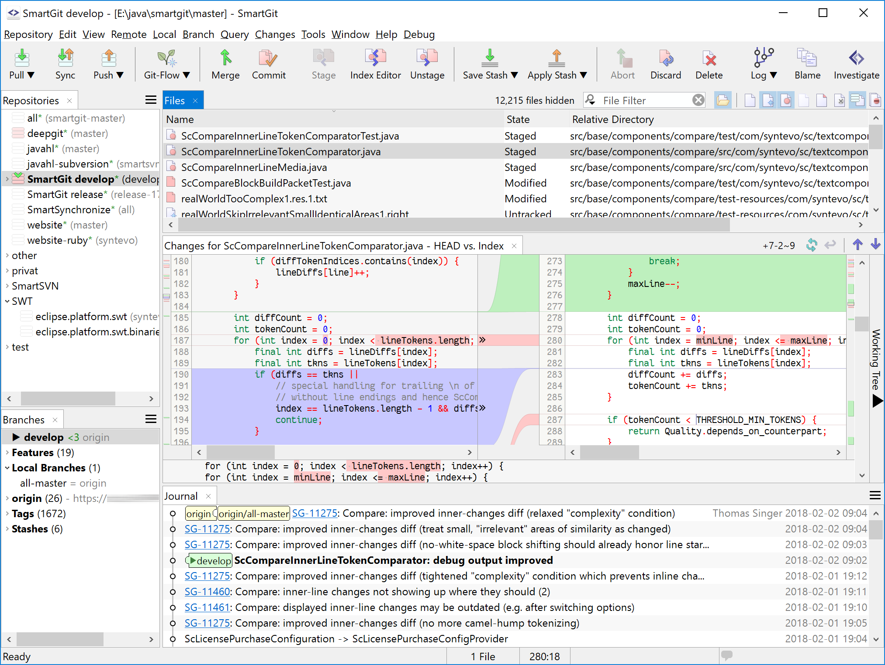
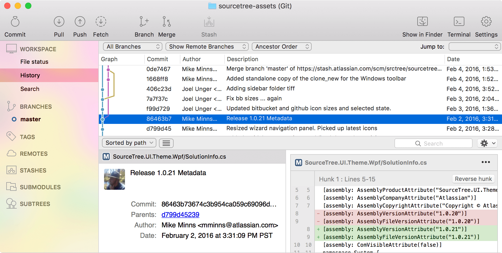
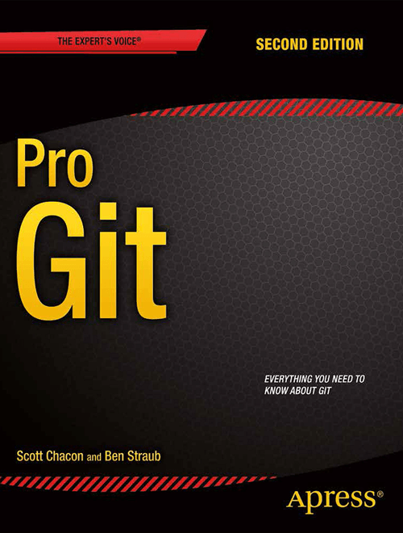

<!-- _footer: "**Espressif Systems Confidential**" -->


# <!--fit--> Git & Workflow

## <!--fit--> Introduction of the Git Workflow in Espressif

💕 𝙸𝙳𝙵 𝙲𝙾𝚁𝙴 𝚃𝙴𝙰𝙼 💕

---

# Overview 📖

<!-- backgroundColor: #E0E0E0 -->

- What is VCS, Git, Smart Git, GitHub, GitLab ...
- How to get started with Git
- How to submit Merge Request

---

<!-- _backgroundImage: "linear-gradient(to bottom, #880E4F, #EC407A)" -->
<!-- _color: white -->

# <!--fit--> Introduction of Git 🥇

---

<!-- paginate: true -->
<!-- _header: "**VCS**" -->


# <!-- fit --> 👈🏿 A Simple Version Control System (VCS) 🙈

- Efficiency ❓
- Speed ❓
- Conflict ❓

---

<!-- _header: "**Git**" -->


> [Git](https://git-scm.com/) is a free and open source **distributed** version control system with *speed* and *efficiency*

---

<!-- _header: "**Repository**" -->
<!-- _footer: "[GitHub](https://github.com/espressif/esp-idf) 💗 [GitLab](https://gitlab.espressif.cn:6688/espressif/esp-idf)" -->


# <!--fit-->GitHub 🆚 GitLab

- Web-based Git repository
- Issue tracking
- GitLab: built-in **CI/CD**
- GitHub: community **PR**

---

<!-- _header: "**Git GUI**" -->
<!-- _footer: "[SmartGit](https://www.syntevo.com/smartgit/) 💗 [Sourcetree](https://www.sourcetreeapp.com/)" -->




---

<!-- _paginate: false -->
<!-- _backgroundImage: "linear-gradient(to bottom, #2E7D32, #00E676)" -->
<!-- _color: white -->

# <!--fit--> Get Started with Git 🐾

---

<!-- _header: "Let Git Track Project 🚜" -->
<style scoped>code { font-size: 80%; }</style>

```bash
morris:~/Desktop$ mkdir oh_my_project
morris:~/Desktop$ cd oh_my_project/
morris:~/Desktop/oh_my_project$ touch README.md
morris:~/Desktop/oh_my_project$ echo "# Oh My Project" >> README.md 
morris:~/Desktop/oh_my_project$ git init
Initialized empty Git repository in /home/maoshengrong/Desktop/oh_my_project/.git/

morris:~/Desktop/oh_my_project$ git status
On branch master
Initial commit
Untracked files:
  (use "git add <file>..." to include in what will be committed)
        README.md
nothing added to commit but untracked files present (use "git add" to track)
```

---

<!-- _header: "Add and Commit to Git 📢" -->

```bash
morris:~/Desktop/oh_my_project$ git add README.md 
morris:~/Desktop/oh_my_project$ git status
On branch master
Initial commit
Changes to be committed:
  (use "git rm --cached <file>..." to unstage)
        new file:   README.md

morris:~/Desktop/oh_my_project$ git commit -m "add README.md"
[master (root-commit) b8ab76f] add README.md
 1 file changed, 1 insertion(+)
 create mode 100644 README.md

morris:~/Desktop/oh_my_project$ git status
On branch master
nothing to commit, working directory clean
```

---

<!-- _header: "Create Repository on Remote 🏭" -->


---

<!-- _header: "Push to Remote Repo 🚚" -->
<style scoped>code { font-size: 60%; }</style>

```bash
morris:~/Desktop/oh_my_project$ git remote add origin ssh://git@gitlab.espressif.cn:27227/srmao/oh-my-project.git
morris:~/Desktop/oh_my_project$ git push -u origin master 
Counting objects: 3, done.
Writing objects: 100% (3/3), 232 bytes | 0 bytes/s, done.
Total 3 (delta 0), reused 0 (delta 0)
To ssh://git@gitlab.espressif.cn:27227/srmao/oh-my-project.git
 * [new branch]      master -> master
Branch master set up to track remote branch master from origin by rebasing.

morris:~/Desktop/oh_my_project$ git status
On branch master
Your branch is up-to-date with 'origin/master'.
nothing to commit, working directory clean
```

---

<!-- _header: "New Branch 🌳" -->
<style scoped>code { font-size: 80%; }</style>

```bash
morris:~/Desktop/oh_my_project$ git branch 
* master
morris:~/Desktop/oh_my_project$ git checkout -b "feature/update_readme"
Switched to a new branch 'feature/update_readme'

morris:~/Desktop/oh_my_project$ git branch 
* feature/update_readme
  master
```

⏳ ... working on new branch ...

```bash
morris:~/Desktop/oh_my_project$ git push origin feature/update_readme 
Counting objects: 3, done.
Writing objects: 100% (3/3), 298 bytes | 0 bytes/s, done.
Total 3 (delta 0), reused 0 (delta 0)
To ssh://git@gitlab.espressif.cn:27227/srmao/oh-my-project.git
 * [new branch]      feature/update_readme -> feature/update_readme
```

---

<!-- _header: "**Git Command Cheat Sheet 1 💯**" -->
<style scoped>table { font-size: 90%; }</style>

| Command     | Description                        |
| :---------- | :--------------------------------- |
| init        | initialize an empty repository     |
| config      | setup name, email, etc             |
| add         | add changes to staging area        |
| rm          | remove file from repository        |
| rm --cached | remove file only from staging area |
| commit      | commit the changes in staging area |
| clone       | clone a remote repository to local |
| status      | check status of current branch     |

---

<!-- _header: "**Git Command Cheat Sheet 2 💯**" -->
<style scoped>table { font-size: 80%; }</style>

| Command           | Description                             |
| :---------------- | :-------------------------------------- |
| stash / stash pop | push / pop changes to / from stack area |
| mv                | rename or move file                     |
| log               | investigate the logs of commits         |
| reflog            | check history operation                 |
| push --tags       | push the tag to remote repository       |
| commit --amend    | update the latest commit                |
| commit --date     | specify the commit date                 |
| checkout <file>   | undo the modification of some file      |

---

<!-- _header: "**Git Command Cheat Sheet 3 💯**" -->
<style scoped>table { font-size: 70%; }</style>

| Command      | Description                                             |
| :----------- | :------------------------------------------------------ |
| reset <file> | un-stage some file                                      |
| reset --soft | undo the last commit (keep the changes in staging area) |
| remote -v    | check the url of remote repository                      |
| pull         | pull changes from remote repository (auto-merge)        |
| remote add   | add a remote repository                                 |
| diff <file>  | find out changed lines in some file                     |
| tag          | give the current commit a new tag                       |
| blame <file> | find out who introduced a bug 🤔                         |

---

<!-- _header: "**Git Command Cheat Sheet 4 💯**" -->
<style scoped>table { font-size: 70%; }</style>

| Command            | Description                              |
| :----------------- | :--------------------------------------- |
| branch             | list all branches                        |
| branch <nb> <hash> | create a new branch based on some commit |
| branch -d <name>   | delete a branch                          |
| branch -m <name>   | rename a branch                          |
| checkout <nb>      | switch to another branch                 |
| checkout -b <nb>   | create a new branch and then switch to   |
| checkout -         | switch to last branch                    |
| checkout <tag>     | switch to a specific tag                 |

---

<!-- _header: "**Git Command Cheat Sheet 5 💯**" -->
<style scoped>table { font-size: 70%; }</style>

| Command                | Description                                   |
| :--------------------- | :-------------------------------------------- |
| push <remote> <branch> | push a branch to remote repository            |
| merge <branch>         | merge another branch to current one           |
| fetch                  | get changes from remote without merge         |
| bisect                 | find out which commit introduced bug          |
| cherry-pick <hash>     | make use of the commits from others           |
| rebase                 | rebase current branch onto another one        |
| add <file> --edit      | specify the lines to stage                    |
| revert                 | undo a commit which has been pushed to remote |

---

<!-- _header: "**Git Manual 👨‍🏫**" -->
<style scoped>code { font-size: 40%; }</style>


```bash
$ tldr git-log
  - Show the sequence of commits starting from the current one, in reverse chronological order:
    git log
  - Show the history of a particular file or directory, including differences:
    git log -p path/to/file_or_directory
  - Show only the first line of each commit message:
    git log --oneline
  - Show an overview of which file(s) changed in each commit:
    git log --stat
  - Show a graph of commits in the current branch:
    git log --graph
  - Show a graph of all commits, tags and branches in the entire repo:
    git log --oneline --decorate --all --graph
  - Show only commits whose messages include a given string (case-insensitively):
    git log -i --grep search_string
```

---

<!-- _header: "**Git Alias 🔨**" -->
<style scoped>code { font-size: 50%; }</style>

# <!--fit--> Set alias for common used commands in **~/.gitconfig** file

```
[alias]
    gl = log -n 30 --date-order --format=\"%Cgreen%h %Cred[%ci] %Creset <%an>%C(yellow)%d%Creset %Creset %Cgreen%s %Creset \"
    hist = log --pretty=format:\"%C(yellow)%h %C(red)%d %C(reset)%s %C(green)[%an] %C(blue)%ad\" --topo-order --graph 
    st = status -uno -s
    st2 = status -s
    co = checkout
    bl = blame --date=short
    ci = commit
    dt = difftool
    dif = diff --word-diff
    di = diff --no-ext-diff  
```

---

<!-- _header: "**Git Ignore**" -->

# <!--fit--> *ignore* = do not put the matched files to staging area

##### [.gitignore](https://gitlab.espressif.cn:6688/espressif/esp-idf/blob/master/.gitignore) in esp-idf 👇🏿

```
.config # ignore .config file
*.o # ignore all object file
*.pyc # ignore all python byte code file
examples/**/sdkconfig # ignore sdkconfig files inside examples
examples/**/build # ignore build directory inside examples
```

```
# ignore all .a files but lib.a
*.a
!lib.a
```

---

<!-- _header: "**Git Submodule**" -->

# <!--fit--> *submodule* = 3rd party libraries/tools that reside in *another repository*

##### [.gitmodules](https://gitlab.espressif.cn:6688/espressif/esp-idf/blob/master/.gitmodules) in esp-idf 👇🏿

```
[submodule "components/esptool_py/esptool"]
    path = components/esptool_py/esptool
    url = ../../espressif/esptool.git
[submodule "components/esp_wifi/lib_esp32"]
    path = components/esp_wifi/lib_esp32
    url = ../../espressif/esp32-wifi-lib.git
```

``` bash
# after a fresh git clone, submodule needs update accordingly
git submodule update --init --recursive 
# add a new submodule
git submodule add <submodule_url> submodule_local_path
```

---

<!-- _header: "**Reorder Commits 🔁**" -->
<style scoped>code { font-size: 70%; }</style>


# <!--fit--> What if the commits are <br/> in a wrong order ❓

```bash
git rebase -i <hash>
```

# <!--fit--> 💣 <br/> possible conflict

---

<!-- _header: "**Squash Commits 📥**" -->
<style scoped>code { font-size: 70%;}</style>


# <!--fit--> What if <br/> too many similar commits ❓

```bash
git rebase -i <hash>
```
# <!--fit--> 💯 <br/> squash before merge

---

<!-- _paginate: false -->
<!-- _backgroundImage: "linear-gradient(to bottom, #64B5F6, #0D47A1)" -->
<!-- _color: white -->

# <!--fit--> 😮 Still far from sufficient ......

---

<!-- _header: "**Book Recommendation 📚**" -->


[ProGit Book](https://git-scm.com/book/en/v2)

---

<!-- _header: "**Learn Git the Easy Way 🍰**" -->


# <!--fit--> Learn by Gaming -- `GitHug`

[GitHug Walk Through Guide](https://githug.zhang-ou.com/)

# <!--fit--> Learn in interactive way

[Learn Git Branching](https://learngitbranching.js.org/)

---

<!-- _paginate: false -->
<!-- _backgroundImage: "linear-gradient(to bottom, #FF6D00, #FFAB40)" -->
<!-- _color: white -->

# <!--fit--> Submit Merge Request in GitLab 🙌🏻

---

<!-- _header: "**Branching Model of ESP-IDF 📏**" -->
<style scoped>li { font-size: 70%;}</style>

- **master branch** 👍🏾
  - Name: `master`
  - Where *integration* happens
  - Always produce working code which compiles and passes CI tests
- **feature and bugfix branches** 🐞
  - Name: `feature/xxx` and `bugfix/xxx`
  - Where *development* happens
  - May contain broken or incomplete or testing code
- **release branches** 💪🏽
  - Name: `release/v4.0`
  - Where releases are maintained and bugfixes are backported

---

<!-- _header: "**Git Commit Message Practice 📬**" -->
<style scoped>code { font-size: 80%; }</style>
<style scoped>li { font-size: 80%; }</style>
# <!--fit--> What a good commit message looks like ❓

```bash
vfs/fatfs: fix stat call failing when called for mount point
   
FATFS does not support f_stat call for drive root. When handling stat
for drive root, don't call f_stat and just return struct st with S_IFDIR
flag set.

Closes https://github.com/espressif/esp-idf/issues/984
```

- First Line Rule: `component-name` `Add/Fix/Remove/Change` `THING`
  - esp32: Fix startup timeout issue 👌
- Detailed story after the first line
  - Full link to Github Issues or PRs: `Fixes https://github.com/espressif/esp-idf/issues/73`
  - Jira ticket number: `Closes IDF-123`

---

<!-- _header: "**Development workflow**" -->


---

<!-- _header: "**MR Description**" -->

# <!--fit--> What a good MR Description looks like ❓


---

<!-- _header: "**MR/PR Etiquette 💁🏻‍♂️**" -->
<style scoped>li { font-size: 80%; }</style>

##### Community Etiquette


* Be **polite**, even if the code is not good
* Try best to **review** PR/MR within 1 week of them being opened
* If the MR looks good to you, don't forget to give a **thumbup** 👍

---

<!-- _header: "**Other Useful Links**" -->


- [ESP-IDF Internal Wiki](https://gitlab.espressif.cn:6688/espressif/esp-idf/wikis/home)
- [Sourcegraph](https://sourcegraph.com/github.com/espressif/esp-idf)
- [Read The Docs](https://docs.espressif.com/projects/esp-idf/en/latest/index.html)

---

<!-- _header: "**QA**" -->


[Source File of This Slide](https://gitlab.espressif.cn:6688/srmao/morris_training)
